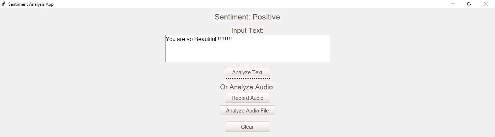

# Sentiment Analysis App

This Sentiment Analysis App is a GUI-based application that allows users to analyze the sentiment of text or audio inputs. It uses the `tkinter` library for the GUI, `TextBlob` for sentiment analysis, and `pyaudio` for recording and handling audio files.

## Image



## Features

- Analyze the sentiment of input text (Positive, Negative, Neutral)
- Record audio and analyze its sentiment
- Analyze sentiment from audio files
- Recognize and handle negative slang words

## Requirements

- Python 3.x
- `tkinter`
- `ttkthemes`
- `pyaudio`
- `wave`
- `speech_recognition`
- `textblob`
- `pandas`

## Installation

1. **Clone the Repository:**

    ```bash
    git clone https://github.com/yourusername/sentiment-analysis-app.git
    cd sentiment-analysis-app
    ```

2. **Install the Required Packages:**

    You can install the required packages using `pip`:

    ```bash
    pip install tk ttkthemes pyaudio wave speechrecognition textblob pandas
    ```

3. **Download NLTK Corpora:**

    TextBlob requires certain NLTK corpora. Download them using the following commands:

    ```python
    python -m textblob.download_corpora
    ```

4. **Prepare Negative Slang Words File:**

    Ensure you have a CSV file named `sl.csv` in the project directory containing a column `Slang Word` with the negative slang words listed.

## Usage

1. **Run the Application:**

    ```bash
    python sentiment_analysis_app.py
    ```

2. **Text Analysis:**

    - Enter the text you want to analyze in the "Input Text" field.
    - Click on the "Analyze Text" button to see the sentiment.

3. **Audio Analysis:**

    - Click on "Record Audio" to record a 5-second audio clip and analyze its sentiment.
    - Click on "Analyze Audio File" to select a `.wav` file and analyze its sentiment.

4. **Clear Input:**

    - Click on the "Clear" button to clear the input text field.

## File Structure

- `sentiment_analysis_app.py`: Main application code
- `sl.csv`: CSV file containing negative slang words

## License

This project is licensed under the MIT License. See the [LICENSE](LICENSE) file for details.

## Acknowledgements

- Themed widgets are provided by `ttkthemes`.
- Sentiment analysis is powered by `TextBlob`.
- Speech recognition is handled by `speech_recognition`.
- Audio recording is facilitated by `pyaudio`.

## Contributing

Contributions are welcome! Please fork the repository and create a pull request with your changes. For major changes, please open an issue first to discuss what you would like to change.

## Author

- **Ayush Shukla**
